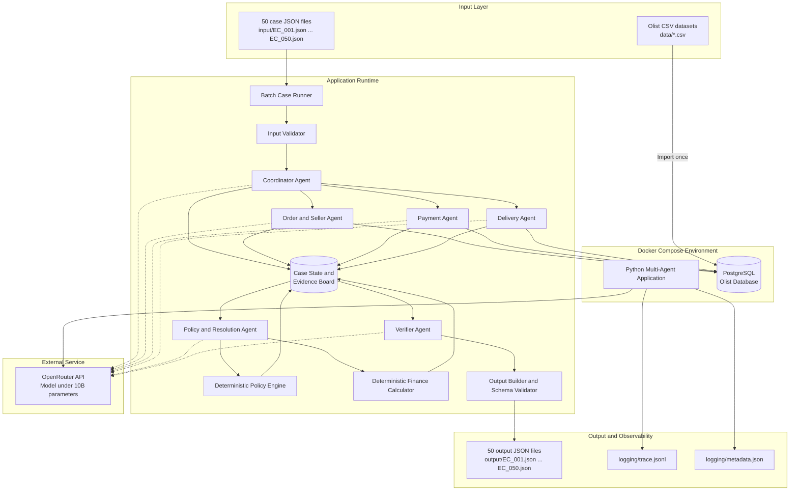
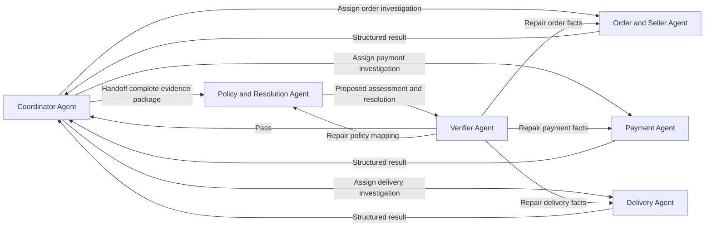
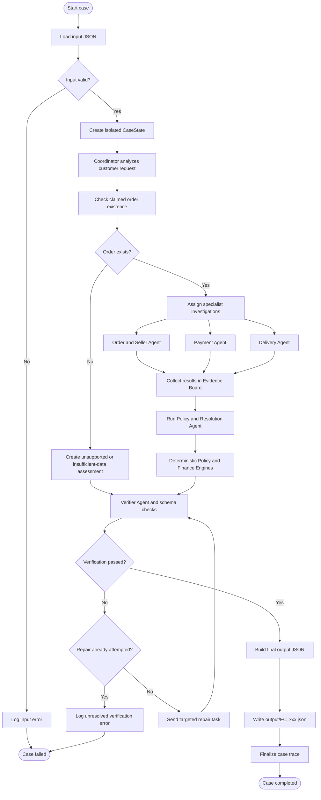
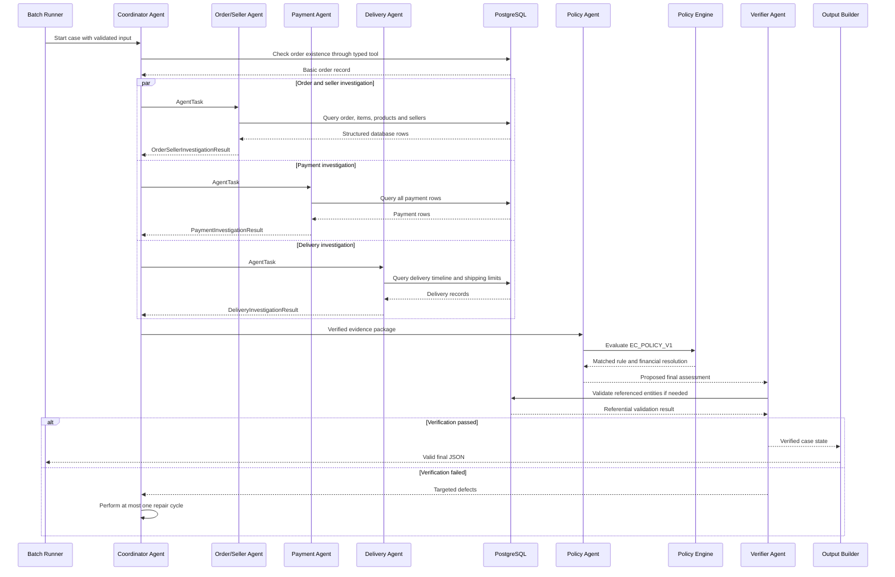
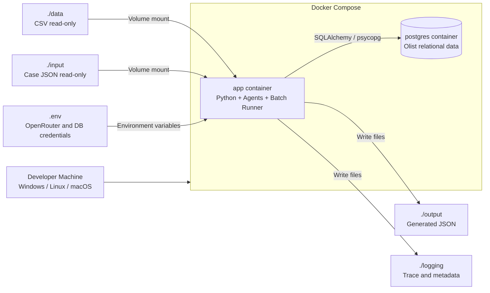

# System Architecture

## 1. Tổng quan

Hệ thống **Multi-Agent E-commerce Dispute Resolution** xử lý theo lô 50 yêu cầu hỗ trợ khách hàng dựa trên dữ liệu Olist Brazilian E-Commerce Public Dataset.

Mỗi yêu cầu đầu vào chứa:

* Mã case.
* Thời điểm mở case.
* Nội dung khiếu nại của khách hàng.
* Mã đơn hàng khách hàng khai báo.
* Phiên bản chính sách cần áp dụng.

Hệ thống sử dụng `claimed_order_id` để truy vấn dữ liệu giao dịch trong PostgreSQL, phân tích khiếu nại bằng nhiều agent chuyên môn, áp dụng chính sách nghiệp vụ và sinh một tệp JSON kết quả tương ứng.

Kiến trúc được lựa chọn là:

> **Centralized Supervisor + Parallel Specialist Agents + Shared Evidence Board + Deterministic Policy Verification**

Trong đó:

* Một **Coordinator Agent** kiểm soát toàn bộ luồng xử lý.
* Các agent chuyên môn điều tra đơn hàng, người bán, thanh toán và giao hàng.
* Kết quả điều tra được lưu vào một **Evidence Board** dùng chung.
* Chính sách hoàn tiền được tính bằng code xác định thay vì để LLM tự tính.
* Một **Verifier Agent** kiểm tra kết quả trước khi ghi ra file.
* PostgreSQL là nguồn dữ liệu có thẩm quyền duy nhất.
* Tất cả LLM được gọi thông qua OpenRouter và phải có dưới 10 tỷ tham số.

---

## 2. Mục tiêu thiết kế

Kiến trúc phải đáp ứng các mục tiêu sau:

1. Xử lý đủ 50 case độc lập.
2. Không để dữ liệu của case này ảnh hưởng đến case khác.
3. Thể hiện rõ quá trình:

   * Phân công nhiệm vụ.
   * Agent-to-agent handoff.
   * Điều tra độc lập.
   * Tổng hợp bằng chứng.
   * Kiểm chứng kết quả.
4. Không để LLM tự tạo dữ liệu giao dịch.
5. Không để LLM trực tiếp thực thi SQL tùy ý.
6. Không để LLM tự tính toán tổng tiền hoặc hoàn tiền.
7. Sinh output đúng JSON schema và đúng giới hạn số phần tử.
8. Có trace đầy đủ cho toàn bộ lượt chạy.
9. Có thể chạy lại bằng Docker trên Windows, Linux hoặc macOS.
10. Tuân thủ yêu cầu mọi model sử dụng phải dưới 10 tỷ tham số.

---

## 3. Các quyết định kiến trúc chính

### 3.1. Sử dụng PostgreSQL thay vì đọc CSV trực tiếp

Các file CSV được import vào PostgreSQL trước khi xử lý case.

Lý do:

* Dữ liệu Olist có nhiều quan hệ một-nhiều.
* Một order có thể có nhiều item.
* Một order có thể có nhiều seller.
* Một order có thể có nhiều payment row.
* Truy vấn SQL giúp join dữ liệu chính xác hơn.
* Có thể tạo index theo `order_id`, `seller_id` và `product_id`.
* Tránh phải đọc lại toàn bộ CSV cho từng agent và từng case.
* Dễ kiểm soát quyền truy cập dữ liệu.
* Dễ viết test cho các truy vấn nghiệp vụ.

PostgreSQL là **system of record**. Mọi kết luận phải truy ngược được về dữ liệu trong PostgreSQL.

### 3.2. Sử dụng supervisor thay vì agent swarm tự do

Các agent không tự do trao đổi hoặc chuyển nhiệm vụ vòng tròn cho nhau. Mọi phân công và handoff đều đi qua Coordinator Agent.

Lý do:

* Chỉ có 50 case và workflow tương đối rõ.
* Dễ kiểm soát số lần gọi LLM.
* Dễ ghi trace.
* Ngăn vòng lặp agent-to-agent.
* Dễ xác định agent chịu trách nhiệm cho từng kết luận.
* Coordinator luôn giữ quyền tạo kết quả cuối cùng.
* Phù hợp với yêu cầu chấm điểm về assignment, handoff và verification.

### 3.3. Chạy các điều tra độc lập song song

Sau khi xác thực đơn hàng, ba nhánh điều tra có thể chạy song song:

* Order and Seller Investigation.
* Payment Investigation.
* Delivery Investigation.

Ba nhánh chỉ đọc dữ liệu và không phụ thuộc vào kết luận của nhau.

Cách này giảm thời gian xử lý nhưng vẫn bảo đảm Coordinator kiểm soát luồng.

### 3.4. Tách reasoning của LLM khỏi tính toán xác định

LLM được sử dụng cho:

* Hiểu nội dung khiếu nại.
* Xác định intent của khách hàng.
* Diễn giải kết quả điều tra.
* Xếp hạng nguyên nhân.
* Chọn cách mô tả resolution action.
* Phát hiện mâu thuẫn giữa claim và dữ liệu.

Code xác định được sử dụng cho:

* Truy vấn PostgreSQL.
* Tổng hợp item total.
* Tổng hợp freight total.
* Tổng hợp payment total.
* So sánh timestamp.
* Kiểm tra sai số 0.10 BRL.
* Áp dụng điều kiện hoàn tiền.
* Kiểm tra JSON schema.
* Kiểm tra giới hạn số phần tử.
* Kiểm tra evidence ID.
* Làm tròn tiền đến hai chữ số thập phân.

LLM không được thay đổi kết quả do deterministic policy engine tính ra.

---

## 4. Kiến trúc tổng thể



---

## 5. Thành phần hệ thống

### 5.1. Batch Case Runner

Batch Case Runner là thành phần không sử dụng LLM.

Trách nhiệm:

* Tìm các file `input/EC_*.json`.
* Sắp xếp case theo `case_id`.
* Kiểm tra có đúng 50 case hay không.
* Tạo một `run_id` cho lượt chạy.
* Tạo state độc lập cho từng case.
* Gọi workflow xử lý từng case.
* Quản lý concurrency.
* Ghi output theo đúng tên file đầu vào.
* Ghi số lượng case thành công và thất bại vào metadata.
* Không cho một case thất bại làm dừng toàn bộ batch.

Mỗi case phải có:

* `case_id` riêng.
* `thread_id` hoặc `workflow_id` riêng.
* State riêng.
* Trace riêng.
* Output riêng.

Không sử dụng memory chung giữa các case.

### 5.2. Input Validator

Input Validator kiểm tra:

* File có phải JSON hợp lệ hay không.
* Có đủ các trường bắt buộc hay không.
* `case_id` có khớp với tên file hay không.
* `claimed_order_id` có đúng định dạng hay không.
* `policy_version` có được hỗ trợ hay không.
* Có case trùng `case_id` hay không.
* Có case trùng tên file hay không.

Input Validator không sửa nội dung case. Nếu dữ liệu đầu vào không hợp lệ, lỗi phải được ghi vào trace.

### 5.3. Coordinator Agent

Coordinator Agent là supervisor của workflow.

Trách nhiệm:

1. Đọc nội dung khiếu nại.
2. Xác định intent sơ bộ:

   * Canceled order.
   * Unavailable order.
   * Late delivery.
   * Payment confusion.
   * Refund request.
   * Unsupported hoặc ambiguous claim.
3. Tạo kế hoạch điều tra.
4. Phân công nhiệm vụ cho các specialist agent.
5. Theo dõi trạng thái từng nhiệm vụ.
6. Thu nhận kết quả của các specialist.
7. Chuyển Evidence Board sang Policy and Resolution Agent.
8. Nhận kết quả kiểm chứng.
9. Chỉ yêu cầu sửa lại agent có lỗi.
10. Kết thúc workflow sau tối đa một vòng repair.

Coordinator Agent không được:

* Truy cập PostgreSQL trực tiếp.
* Viết SQL.
* Tự tính tổng tiền.
* Tự tạo evidence ID.
* Tự ghi output JSON.
* Ghi đè dữ liệu do deterministic tool trả về.
* Tự kết luận refund nếu chưa chạy Policy Engine.

### 5.4. Order and Seller Agent

Order and Seller Agent điều tra dữ liệu đơn hàng, item, product và seller.

Nguồn dữ liệu được phép truy cập:

* `olist_orders`.
* `olist_order_items`.
* `olist_products`.
* `olist_sellers`.
* `product_category_translation`.

Trách nhiệm:

* Xác nhận order có tồn tại hay không.
* Đọc `order_status`.
* Lấy danh sách item của order.
* Lấy seller tương ứng với từng item.
* Lấy giá item và freight của từng dòng.
* Xác định các item liên quan.
* Xác định các seller liên quan.
* Tạo evidence ID cho order, item và seller.
* Phát hiện trường hợp order không có item row.
* Không suy diễn về refund hoặc trách nhiệm cuối cùng.

Output của agent phải có cấu trúc, ví dụ:

```json
{
  "agent": "order_seller_agent",
  "status": "completed",
  "facts": {
    "order_exists": true,
    "order_status": "delivered",
    "item_count": 2,
    "item_total_brl": 120.0,
    "freight_total_brl": 20.0
  },
  "affected_item_ids": ["1", "2"],
  "affected_seller_ids": ["seller_a", "seller_b"],
  "evidence_ids": [
    "order:order_id",
    "item:order_id:1",
    "item:order_id:2",
    "seller:seller_a",
    "seller:seller_b"
  ],
  "warnings": []
}
```

Giá trị tiền trong output agent phải do Finance Calculator hoặc query service tính, không do LLM tính từ văn bản.

### 5.5. Payment Agent

Payment Agent điều tra toàn bộ payment row của order.

Nguồn dữ liệu được phép truy cập:

* `olist_order_payments`.

Dữ liệu tổng item và freight được nhận qua Case State, không tự join trực tiếp vào bảng item.

Trách nhiệm:

* Lấy tất cả payment row theo `order_id`.
* Sắp xếp theo `payment_sequential`.
* Đếm số payment row.
* Tính tổng `payment_value`.
* Xác định split payment.
* So sánh:

```text
payment_total_brl
```

với:

```text
item_total_brl + freight_total_brl
```

trong sai số tối đa `0.10 BRL`.

* Tạo payment evidence ID.
* Không suy diễn rằng refund đã được thực hiện.
* Không coi nhiều payment row là thanh toán trùng nếu tổng vẫn khớp.
* Không tự đề xuất số tiền hoàn.

Payment ID sử dụng định dạng:

```text
payment:<order_id>:<payment_sequential>
```

### 5.6. Delivery Agent

Delivery Agent điều tra timeline giao hàng.

Nguồn dữ liệu được phép truy cập:

* `olist_orders`.
* `olist_order_items`.
* `olist_order_reviews` ở chế độ bằng chứng bổ sung.

Các trường thời gian chính:

* `order_purchase_timestamp`.
* `order_approved_at`.
* `shipping_limit_date`.
* `order_delivered_carrier_date`.
* `order_delivered_customer_date`.
* `order_estimated_delivery_date`.

Trách nhiệm:

1. Xác định đơn có được giao hay không.
2. So sánh ngày giao thực tế với ngày giao dự kiến.
3. Nếu giao muộn, so sánh ngày carrier nhận hàng với `shipping_limit_date`.
4. Xác định item và seller bị chậm bàn giao.
5. Phân biệt:

   * Seller delay.
   * Logistics delay.
6. Không dùng review để ghi đè timestamp.
7. Không suy diễn checkpoint vận chuyển không có trong dữ liệu.
8. Không suy diễn mất hàng, thiếu hàng hoặc giao sai sản phẩm chỉ từ review.

Quy tắc khi một order có nhiều item:

* Kiểm tra `shipping_limit_date` ở cấp item.
* Item được xem là bàn giao muộn nếu:

```text
order_delivered_carrier_date > shipping_limit_date
```

* Seller chịu trách nhiệm chỉ gồm seller của các item bàn giao muộn.
* Nếu order giao muộn nhưng không có item nào bàn giao cho carrier muộn, trách nhiệm thuộc `logistics_provider`.

### 5.7. Policy and Resolution Agent

Policy and Resolution Agent nhận kết quả đã cấu trúc từ các specialist agent.

Agent này không truy vấn dữ liệu gốc.

Trách nhiệm:

* Đọc intent của khách hàng.
* Đọc các fact đã được xác minh.
* Gọi Deterministic Policy Engine.
* Nhận danh sách policy rule phù hợp.
* Chọn `primary_issue`.
* Xếp hạng tối đa ba nguyên nhân.
* Chọn tối đa ba responsible parties.
* Đề xuất tối đa năm resolution actions.
* Diễn giải kết quả nhưng không thay đổi số tiền.
* Tạo policy evidence ID.

Policy Agent không được tự tạo policy code ngoài danh sách hỗ trợ.

### 5.8. Verifier Agent

Verifier Agent kiểm tra kết quả điều tra trước khi ghi output.

Các nhóm kiểm tra:

#### Groundedness

* Mọi order ID phải tồn tại trong dữ liệu.
* Mọi item ID phải thuộc order.
* Mọi seller ID phải liên quan đến item của order.
* Mọi payment ID phải liên quan đến order.
* Evidence ID phải đúng định dạng.
* Policy evidence phải khớp `primary_issue`.

#### Financial consistency

* `item_total_brl` bằng tổng giá item.
* `freight_total_brl` bằng tổng freight.
* `payment_total_brl` bằng tổng payment row.
* Số tiền hoàn phù hợp policy.
* Các giá trị được làm tròn đến hai chữ số thập phân.
* Không có số tiền âm.

#### Policy consistency

* Canceled hoặc unavailable và đã thanh toán phải hoàn full payment.
* Late delivery phải hoàn freight.
* Valid split payment không được hoàn tiền.
* Unsupported late claim không được hoàn tiền.
* `case_status` phải phù hợp với action.

#### Schema consistency

* Không thiếu trường bắt buộc.
* `confidence` nằm trong `[0, 1]`.
* `case_status` chỉ thuộc danh sách được README cho phép.
* Không vượt giới hạn số phần tử.
* Không có ID trùng lặp.
* Output có thể serialize thành JSON.

Nếu verification thất bại:

* Verifier trả về danh sách defect có cấu trúc.
* Coordinator chỉ gửi repair task cho agent liên quan.
* Cho phép tối đa một vòng repair.
* Nếu vẫn thất bại, case được đánh dấu lỗi trong trace và không được âm thầm tạo dữ liệu giả.

### 5.9. Output Builder

Output Builder là thành phần không sử dụng LLM.

Trách nhiệm:

* Lấy state cuối cùng.
* Tạo object theo đúng output schema.
* Chuẩn hóa danh sách ID.
* Loại bỏ ID trùng.
* Áp giới hạn số phần tử.
* Làm tròn số tiền.
* Validate bằng Pydantic hoặc JSON Schema.
* Ghi file bằng UTF-8.
* Ghi atomically qua file tạm rồi rename.

Chỉ Output Builder được phép ghi vào thư mục `output/`.

---

## 6. Agent-to-Agent communication

### 6.1. Nguyên tắc giao tiếp

Các agent không truyền raw prompt hoặc toàn bộ lịch sử hội thoại cho nhau.

Mỗi handoff sử dụng một message có cấu trúc gồm:

* ID nhiệm vụ.
* Agent gửi.
* Agent nhận.
* Case ID.
* Mục tiêu nhiệm vụ.
* Các fact đã được xác minh.
* Các fact còn thiếu.
* Công cụ được phép sử dụng.
* Output schema mong đợi.
* Deadline.
* Correlation ID.
* Trace parent ID.

### 6.2. Task message

```json
{
  "message_type": "agent_task",
  "task_id": "task-uuid",
  "case_id": "EC_001",
  "sender": "coordinator_agent",
  "recipient": "payment_agent",
  "goal": "Investigate all payment records for the claimed order",
  "known_facts": {
    "order_id": "claimed-order-id",
    "item_total_brl": 120.0,
    "freight_total_brl": 20.0
  },
  "allowed_tools": [
    "get_order_payments",
    "calculate_payment_total",
    "check_payment_match"
  ],
  "expected_output": "PaymentInvestigationResult",
  "correlation_id": "run-id:EC_001",
  "parent_span_id": "span-uuid"
}
```

### 6.3. Result message

```json
{
  "message_type": "agent_result",
  "task_id": "task-uuid",
  "case_id": "EC_001",
  "sender": "payment_agent",
  "recipient": "coordinator_agent",
  "status": "completed",
  "facts": {
    "payment_count": 2,
    "payment_total_brl": 140.0,
    "is_split_payment": true,
    "payment_matches_order_total": true
  },
  "evidence_ids": [
    "payment:claimed-order-id:1",
    "payment:claimed-order-id:2"
  ],
  "warnings": [],
  "correlation_id": "run-id:EC_001",
  "span_id": "span-uuid"
}
```

### 6.4. Handoff graph



Agent-to-agent handoff được ghi vào `trace.jsonl`. Không có specialist agent nào được tự handoff sang specialist khác.

---

## 7. Workflow xử lý một case



---

## 8. Sequence xử lý một case



---

## 9. Case State và Evidence Board

Mỗi case có một state độc lập.

```python
class CaseState:
    run_id: str
    case_id: str
    input_case: dict

    customer_intent: dict
    claimed_order_id: str
    policy_version: str

    order_result: dict | None
    payment_result: dict | None
    delivery_result: dict | None

    verified_facts: dict
    evidence_registry: dict

    policy_result: dict | None
    verification_result: dict | None

    repair_count: int
    errors: list[dict]
    final_output: dict | None
```

Evidence Board chỉ chứa dữ liệu đã được cấu trúc.

Ví dụ:

```json
{
  "case_id": "EC_001",
  "order_id": "order-id",
  "facts": {
    "order_status": "delivered",
    "item_total_brl": 120.0,
    "freight_total_brl": 20.0,
    "payment_total_brl": 140.0,
    "payment_count": 2,
    "delivered_late": false,
    "seller_handoff_late": false
  },
  "evidence": {
    "order:order-id": {
      "source_table": "olist_orders",
      "primary_key": {
        "order_id": "order-id"
      }
    },
    "payment:order-id:1": {
      "source_table": "olist_order_payments",
      "primary_key": {
        "order_id": "order-id",
        "payment_sequential": 1
      }
    }
  }
}
```

Customer claim phải được lưu riêng với verified facts.

Ví dụ:

```json
{
  "customer_claim": {
    "claimed_issue": "late_delivery",
    "message": "The package arrived late"
  },
  "verified_facts": {
    "delivered_late": false
  }
}
```

Không được chuyển customer claim thành fact nếu chưa có dữ liệu xác minh.

---

## 10. Thiết kế PostgreSQL

### 10.1. Database schema

Sử dụng schema riêng:

```text
olist
```

Các bảng chính:

| Bảng PostgreSQL              | CSV nguồn                               | Khóa chính đề xuất               |
| ---------------------------- | --------------------------------------- | -------------------------------- |
| `olist.customers`            | `olist_customers_dataset.csv`           | `customer_id`                    |
| `olist.orders`               | `olist_orders_dataset.csv`              | `order_id`                       |
| `olist.order_items`          | `olist_order_items_dataset.csv`         | `(order_id, order_item_id)`      |
| `olist.order_payments`       | `olist_order_payments_dataset.csv`      | `(order_id, payment_sequential)` |
| `olist.order_reviews`        | `olist_order_reviews_dataset.csv`       | Khóa tự tăng                     |
| `olist.products`             | `olist_products_dataset.csv`            | `product_id`                     |
| `olist.sellers`              | `olist_sellers_dataset.csv`             | `seller_id`                      |
| `olist.category_translation` | `product_category_name_translation.csv` | `product_category_name`          |
| `olist.geolocation`          | `olist_geolocation_dataset.csv`         | Khóa tự tăng                     |

Bảng geolocation có thể chứa nhiều dòng cho cùng một ZIP prefix, do đó không dùng ZIP prefix làm khóa chính.

### 10.2. Kiểu dữ liệu

Các trường tiền:

```sql
NUMERIC(12, 2)
```

Các timestamp:

```sql
TIMESTAMP
```

Các ID:

```sql
VARCHAR
```

`order_item_id`, `payment_sequential` và `payment_installments`:

```sql
INTEGER
```

### 10.3. Index

Các index tối thiểu:

```sql
CREATE INDEX idx_orders_customer_id
ON olist.orders(customer_id);

CREATE INDEX idx_order_items_order_id
ON olist.order_items(order_id);

CREATE INDEX idx_order_items_seller_id
ON olist.order_items(seller_id);

CREATE INDEX idx_order_items_product_id
ON olist.order_items(product_id);

CREATE INDEX idx_order_payments_order_id
ON olist.order_payments(order_id);

CREATE INDEX idx_order_reviews_order_id
ON olist.order_reviews(order_id);

CREATE INDEX idx_order_items_shipping_limit
ON olist.order_items(shipping_limit_date);
```

### 10.4. Tránh nhân bản tổng tiền khi join

Không được join trực tiếp item rows với payment rows rồi mới tính tổng.

Ví dụ, một order có:

* 2 item rows.
* 3 payment rows.

Join trực tiếp sẽ tạo 6 dòng và làm tổng tiền bị nhân lên.

Phải aggregate từng bảng trước:

```sql
WITH item_agg AS (
    SELECT
        order_id,
        COUNT(*) AS item_count,
        COALESCE(SUM(price), 0)::NUMERIC(12, 2) AS item_total_brl,
        COALESCE(SUM(freight_value), 0)::NUMERIC(12, 2) AS freight_total_brl
    FROM olist.order_items
    WHERE order_id = :order_id
    GROUP BY order_id
),
payment_agg AS (
    SELECT
        order_id,
        COUNT(*) AS payment_count,
        COALESCE(SUM(payment_value), 0)::NUMERIC(12, 2) AS payment_total_brl
    FROM olist.order_payments
    WHERE order_id = :order_id
    GROUP BY order_id
)
SELECT
    o.order_id,
    o.order_status,
    COALESCE(i.item_count, 0) AS item_count,
    COALESCE(i.item_total_brl, 0) AS item_total_brl,
    COALESCE(i.freight_total_brl, 0) AS freight_total_brl,
    COALESCE(p.payment_count, 0) AS payment_count,
    COALESCE(p.payment_total_brl, 0) AS payment_total_brl
FROM olist.orders o
LEFT JOIN item_agg i ON i.order_id = o.order_id
LEFT JOIN payment_agg p ON p.order_id = o.order_id
WHERE o.order_id = :order_id;
```

### 10.5. Import CSV

Nên dùng một Python import script thay vì phụ thuộc hoàn toàn vào shell script của PostgreSQL.

Lý do:

* Dễ chạy trên Windows.
* Dễ kiểm tra encoding UTF-8.
* Dễ parse timestamp.
* Dễ kiểm tra số dòng.
* Dễ chạy lại theo cách idempotent.
* Dễ ghi log bảng nào đã import thành công.

Luồng import:

1. Khởi động PostgreSQL.
2. Chờ health check thành công.
3. Chạy migration tạo schema và table.
4. Chạy `scripts/import_olist_csv.py`.
5. Kiểm tra row count.
6. Tạo index.
7. Đánh dấu database đã sẵn sàng.

CSV được mount read-only vào container application:

```yaml
volumes:
  - ./data:/app/data:ro
```

---

## 11. Database tools

Agent không được nhận một công cụ `execute_sql(sql: str)` tổng quát.

Thay vào đó, cung cấp các typed tools:

```text
get_order(order_id)
get_order_items(order_id)
get_order_sellers(order_id)
get_order_payments(order_id)
get_order_delivery_timeline(order_id)
get_order_reviews(order_id)
calculate_order_financials(order_id)
validate_entity_references(order_id, item_ids, seller_ids, payment_ids)
```

Mỗi tool:

* Sử dụng parameterized query.
* Có input schema.
* Có output schema.
* Không cho phép SQL injection.
* Ghi tool call vào trace.
* Không trả dữ liệu của order khác.
* Không trả toàn bộ bảng.
* Không cho agent thay đổi database.

Các agent sử dụng database role chỉ có quyền `SELECT`.

---

## 12. Deterministic Policy Engine

### 12.1. Thứ tự ưu tiên policy

Các rule được kiểm tra theo thứ tự:

1. `canceled_order_paid`
2. `unavailable_order_paid`
3. `late_delivery_seller`
4. `late_delivery_logistics`
5. `valid_split_payment`
6. `unsupported_late_claim`

Thứ tự này tránh trường hợp một canceled order có nhiều payment row bị phân loại nhầm thành valid split payment.

### 12.2. Canceled order paid

Điều kiện:

```text
order_status == "canceled"
AND payment_total_brl > 0
```

Kết quả:

* `primary_issue`: `canceled_order_paid`
* Responsible party: `platform`
* Recommended refund:

```text
payment_total_brl
```

* `case_status`: `action_required`

### 12.3. Unavailable order paid

Điều kiện:

```text
order_status == "unavailable"
AND payment_total_brl > 0
```

Kết quả:

* `primary_issue`: `unavailable_order_paid`
* Responsible party: `platform`
* Recommended refund:

```text
payment_total_brl
```

* `case_status`: `action_required`

### 12.4. Late delivery caused by seller

Điều kiện:

```text
order_delivered_customer_date > order_estimated_delivery_date
AND
at least one item has:
order_delivered_carrier_date > shipping_limit_date
```

Kết quả:

* `primary_issue`: `late_delivery_seller`
* Responsible parties:

  * Các seller có item bàn giao muộn.
* Recommended refund:

```text
freight_total_brl
```

* `case_status`: `action_required`

### 12.5. Late delivery caused by logistics provider

Điều kiện:

```text
order_delivered_customer_date > order_estimated_delivery_date
AND
no item has:
order_delivered_carrier_date > shipping_limit_date
```

Kết quả:

* `primary_issue`: `late_delivery_logistics`
* Responsible party: `logistics_provider`
* Recommended refund:

```text
freight_total_brl
```

* `case_status`: `action_required`

### 12.6. Valid split payment

Điều kiện:

```text
payment_count >= 2
AND
ABS(
    payment_total_brl
    - (item_total_brl + freight_total_brl)
) <= 0.10
```

Kết quả:

* `primary_issue`: `valid_split_payment`
* Không có responsible party gây lỗi.
* Recommended refund:

```text
0.00
```

* `case_status`: `no_action`

### 12.7. Unsupported late claim

Điều kiện:

```text
order_delivered_customer_date <= order_estimated_delivery_date
AND
ABS(
    payment_total_brl
    - (item_total_brl + freight_total_brl)
) <= 0.10
```

Kết quả:

* `primary_issue`: `unsupported_late_claim`
* Không hoàn tiền.
* Recommended refund:

```text
0.00
```

* `case_status`: `no_action`

### 12.8. Không có item row

Nếu order không có item row:

```text
item_ids = []
seller_ids = []
item_total_brl = 0.00
freight_total_brl = 0.00
```

Không được suy diễn item hoặc seller từ nội dung customer request.

---

## 13. Financial Calculator

Finance Calculator phải sử dụng `Decimal`, không sử dụng `float` cho các phép tính tiền.

Ví dụ:

```python
from decimal import Decimal, ROUND_HALF_UP

MONEY_QUANTIZER = Decimal("0.01")
PAYMENT_TOLERANCE = Decimal("0.10")


def money(value: Decimal) -> Decimal:
    return value.quantize(MONEY_QUANTIZER, rounding=ROUND_HALF_UP)
```

Quy tắc:

```text
order_total = item_total + freight_total
```

```text
payment_matches =
ABS(payment_total - order_total) <= 0.10
```

```text
canceled/unavailable refund = payment_total
```

```text
late delivery refund = freight_total
```

```text
valid split payment refund = 0
```

```text
unsupported late claim refund = 0
```

LLM chỉ được đọc kết quả cuối cùng của Finance Calculator.

---

## 14. Evidence management

Evidence ID hợp lệ:

```text
order:<order_id>
item:<order_id>:<order_item_id>
payment:<order_id>:<payment_sequential>
seller:<seller_id>
policy:<root_cause_code>
```

Evidence registry phải kiểm tra:

* Evidence order có đúng order đang xử lý không.
* Item evidence thuộc đúng order.
* Payment evidence thuộc đúng order.
* Seller evidence liên quan đến ít nhất một item.
* Policy evidence thuộc rule engine.
* Không có evidence tự tạo từ customer message.
* Không có evidence ID không truy ngược được về dữ liệu.

Thứ tự ưu tiên evidence khi bị giới hạn tối đa 10 phần tử:

1. Order evidence.
2. Policy evidence.
3. Item evidence liên quan trực tiếp.
4. Payment evidence liên quan trực tiếp.
5. Seller evidence liên quan trực tiếp.
6. Evidence bổ sung.

Review không có định dạng evidence ID riêng trong yêu cầu, do đó review chỉ được dùng làm supporting context nội bộ và không được thêm một evidence ID không hợp lệ vào output.

---

## 15. Output validation

Output cuối cùng phải có:

```text
case_id
assessment
affected_entities
root_cause_analysis
evidence_ids
financial_resolution
resolution_actions
```

Các giới hạn:

| Trường              |  Giới hạn |
| ------------------- | --------: |
| Order IDs           |  Tối đa 5 |
| Item IDs            |  Tối đa 5 |
| Seller IDs          |  Tối đa 5 |
| Payment IDs         |  Tối đa 5 |
| Evidence IDs        | Tối đa 10 |
| Ranked causes       |  Tối đa 3 |
| Responsible parties |  Tối đa 3 |
| Resolution actions  |  Tối đa 5 |

Các invariant:

```text
0 <= confidence <= 1
```

```text
case_status in {"action_required", "no_action"}
```

```text
currency == "BRL"
```

```text
recommended_refund_brl >= 0
```

```text
primary_issue == root_cause_analysis.ranked_causes[0].code
```

Khi `case_status == "no_action"`:

```text
recommended_refund_brl == 0.00
```

Khi `primary_issue` là canceled hoặc unavailable:

```text
recommended_refund_brl == payment_total_brl
```

Khi `primary_issue` là late delivery:

```text
recommended_refund_brl == freight_total_brl
```

---

## 16. Confidence score

Confidence không nên để LLM tự chọn hoàn toàn.

Giá trị cơ sở được xác định bằng code:

| Điều kiện                                          |                          Confidence cơ sở |
| -------------------------------------------------- | ----------------------------------------: |
| Rule khớp hoàn toàn, đầy đủ dữ liệu                |                                      0.98 |
| Rule khớp nhưng thiếu dữ liệu không quan trọng     |                                      0.93 |
| Intent khách hàng mơ hồ nhưng dữ liệu giao dịch rõ |                                      0.90 |
| Thiếu timestamp hoặc dữ liệu cần thiết             |                        0.75 hoặc thấp hơn |
| Không tìm thấy order                               | Tùy schema và cách xử lý unsupported case |

Có thể trừ điểm:

* Thiếu item rows.
* Thiếu payment rows.
* Thiếu timestamp cần cho rule.
* Customer claim và verified facts mâu thuẫn.
* Agent trả kết quả phải repair.
* Referential verification không đầy đủ.

Giá trị cuối cùng phải được clamp vào `[0, 1]`.

---

## 17. OpenRouter và giới hạn model dưới 10B

### 17.1. Model configuration

Model được cấu hình qua environment variable:

```env
OPENROUTER_API_KEY=
OPENROUTER_MODEL=
OPENROUTER_BASE_URL=
LLM_TEMPERATURE=0.1
LLM_MAX_RETRIES=2
```

Không commit `.env` vào Git.

Repo chỉ chứa:

```text
.env.example
```

### 17.2. Kiểm soát tham số model

Tạo file:

```text
config/model_registry.yaml
```

Ví dụ:

```yaml
models:
  selected:
    slug: "<exact-openrouter-model-slug>"
    provider: "openrouter"
    parameter_count_b: 8.0
    instruction_tuned: true
    verified_source: "<public-model-card-url>"
    verified_at: "<date>"

constraints:
  max_parameter_count_b: 10.0
```

Khi application khởi động:

1. Đọc model slug.
2. Đọc `parameter_count_b`.
3. Nếu lớn hơn hoặc bằng giới hạn không được phép, dừng chương trình.
4. Nếu không có thông tin parameter count, dừng chương trình.
5. Ghi model vào `logging/metadata.json`.

Không sử dụng:

```text
openrouter/auto
```

hoặc model alias có thể tự chuyển sang model lớn hơn.

Phải sử dụng exact model slug đã xác minh có dưới 10 tỷ tham số.

Không cho phép fallback sang một model khác nếu model fallback chưa được đăng ký và xác minh.

### 17.3. Cấu hình inference

Khuyến nghị:

```text
temperature: 0.0–0.2
top_p: thấp hoặc mặc định
structured output: bật nếu model hỗ trợ
max retries: 2
timeout: có giới hạn
```

Tất cả agent có thể dùng cùng một model 7B–9B, nhưng sử dụng:

* System prompt khác nhau.
* Tool allowlist khác nhau.
* Output schema khác nhau.
* Context khác nhau.

Cách này đơn giản hóa việc chứng minh mọi agent đều dùng model dưới 10B.

---

## 18. Docker deployment

Hệ thống sử dụng hai service chính:

1. `app`: Python multi-agent application.
2. `postgres`: PostgreSQL database.



PostgreSQL cần có health check. Application chỉ chạy import hoặc batch processing sau khi database sẵn sàng.

Ví dụ thứ tự vận hành:

```text
docker compose up -d postgres
docker compose run --rm app python -m scripts.import_olist_csv
docker compose run --rm app python -m src.batch_runner
```

Không lưu dữ liệu PostgreSQL trực tiếp trong Git. Sử dụng named volume.

---

## 19. Logging và tracing

### 19.1. trace.jsonl

Mỗi dòng là một JSON object.

Các event type đề xuất:

```text
run_started
case_started
input_validated
task_assigned
agent_started
tool_called
tool_completed
agent_completed
handoff_created
policy_evaluated
verification_started
verification_failed
repair_requested
verification_passed
output_written
case_completed
case_failed
run_completed
```

Cấu trúc trace:

```json
{
  "timestamp": "RFC3339 timestamp",
  "run_id": "run-uuid",
  "case_id": "EC_001",
  "trace_id": "trace-uuid",
  "span_id": "span-uuid",
  "parent_span_id": "parent-span-uuid",
  "agent": "payment_agent",
  "event_type": "tool_completed",
  "task_id": "task-uuid",
  "tool": "get_order_payments",
  "status": "success",
  "latency_ms": 125,
  "model": null,
  "token_usage": null,
  "evidence_ids": [
    "payment:order-id:1"
  ],
  "error": null
}
```

Đối với LLM call, trace có thêm:

```json
{
  "model": "<exact-model-slug>",
  "temperature": 0.1,
  "prompt_version": "payment-agent-v1",
  "input_hash": "sha256",
  "token_usage": {
    "prompt_tokens": 1000,
    "completion_tokens": 250,
    "total_tokens": 1250
  }
}
```

Không ghi vào trace:

* OpenRouter API key.
* Database password.
* Authorization header.
* Toàn bộ chain-of-thought.
* Secret.
* Raw environment variables.

### 19.2. metadata.json

Metadata mô tả toàn bộ lượt chạy:

```json
{
  "run_id": "run-uuid",
  "started_at": "RFC3339 timestamp",
  "completed_at": "RFC3339 timestamp",
  "git": {
    "branch": "hungnc",
    "commit": "c270ab5"
  },
  "framework": {
    "name": "langgraph",
    "version": "<installed-version>"
  },
  "llm": {
    "provider": "openrouter",
    "model": "<exact-model-slug>",
    "parameter_count_b": 8.0,
    "temperature": 0.1
  },
  "database": {
    "engine": "postgresql",
    "dataset": "olist",
    "imported": true
  },
  "runtime": {
    "docker": true,
    "python_version": "<version>"
  },
  "cases": {
    "expected": 50,
    "processed": 50,
    "succeeded": 50,
    "failed": 0
  }
}
```

Metadata cuối cùng phải được ghi atomically sau khi toàn bộ batch kết thúc.

---

## 20. Error handling

### Database error

* Retry lỗi kết nối tạm thời.
* Không retry lỗi query hoặc schema vô hạn.
* Ghi lỗi và case ID vào trace.
* Không tạo dữ liệu giả.

### OpenRouter timeout hoặc rate limit

* Retry tối đa theo cấu hình.
* Dùng exponential backoff.
* Giữ nguyên exact model slug.
* Không fallback sang model lớn hơn.
* Nếu hết retry, đánh dấu case thất bại.

### Invalid model output

* Parse JSON.
* Validate bằng Pydantic.
* Cho một lần format repair.
* Không cho repair thay đổi deterministic facts.

### Verification failure

* Trả defect về Coordinator.
* Chỉ chạy lại agent liên quan.
* Tối đa một vòng repair.
* Ghi rõ defect vào trace.

### Output write failure

* Ghi file tạm.
* Flush và đóng file.
* Rename sang tên chính thức.
* Không để lại output JSON bị ghi một phần.

---

## 21. Concurrency

Có hai mức concurrency.

### Case-level concurrency

Nhiều case có thể chạy đồng thời.

Giới hạn ban đầu đề xuất:

```text
4 case đồng thời
```

Giá trị thực tế cấu hình qua:

```env
CASE_CONCURRENCY=4
```

### Agent-level concurrency

Trong một case, ba specialist agent có thể chạy song song:

```text
Order and Seller Agent
Payment Agent
Delivery Agent
```

Policy và Verifier phải chạy sau khi các nhánh điều tra cần thiết hoàn thành.

Cần sử dụng semaphore để tránh gọi OpenRouter vượt rate limit.

---

## 22. Framework orchestration

Khuyến nghị sử dụng **LangGraph** vì workflow có:

* State rõ ràng.
* Node chuyên môn.
* Nhánh song song.
* Conditional edge.
* Repair loop có giới hạn.
* Khả năng checkpoint.
* Trace từng node.
* Phù hợp mô hình supervisor và specialist.

Graph logic:

```text
validate_input
    ->
coordinator_triage
    ->
parallel(
    order_seller_agent,
    payment_agent,
    delivery_agent
)
    ->
policy_resolution_agent
    ->
verifier_agent
    ->
    pass: output_builder
    fail and repair_count == 0: targeted_repair
    fail and repair_count > 0: case_failed
```

Không đặt toàn bộ logic trong một prompt duy nhất.

---

## 23. Cấu trúc source code đề xuất

```text
.
├── architecture.md
├── docker-compose.yml
├── Dockerfile
├── pyproject.toml
├── .env.example
├── config/
│   ├── model_registry.yaml
│   └── policy_ec_v1.yaml
├── data/
├── input/
├── output/
├── logging/
│   ├── metadata.json
│   └── trace.jsonl
├── scripts/
│   ├── import_olist_csv.py
│   ├── check_database.py
│   └── validate_outputs.py
├── src/
│   ├── __init__.py
│   ├── batch_runner.py
│   ├── graph.py
│   ├── state.py
│   ├── config.py
│   ├── llm/
│   │   ├── openrouter_client.py
│   │   └── model_guard.py
│   ├── agents/
│   │   ├── coordinator.py
│   │   ├── order_seller.py
│   │   ├── payment.py
│   │   ├── delivery.py
│   │   ├── policy_resolution.py
│   │   └── verifier.py
│   ├── prompts/
│   │   ├── coordinator.md
│   │   ├── order_seller.md
│   │   ├── payment.md
│   │   ├── delivery.md
│   │   ├── policy_resolution.md
│   │   └── verifier.md
│   ├── schemas/
│   │   ├── input_case.py
│   │   ├── agent_messages.py
│   │   ├── agent_results.py
│   │   └── output_case.py
│   ├── database/
│   │   ├── engine.py
│   │   ├── models.py
│   │   ├── migrations.py
│   │   └── repositories.py
│   ├── tools/
│   │   ├── order_tools.py
│   │   ├── payment_tools.py
│   │   ├── delivery_tools.py
│   │   └── verification_tools.py
│   ├── policy/
│   │   ├── engine.py
│   │   └── rules.py
│   ├── finance/
│   │   └── calculator.py
│   ├── verification/
│   │   ├── schema_checks.py
│   │   ├── evidence_checks.py
│   │   ├── finance_checks.py
│   │   └── policy_checks.py
│   ├── output/
│   │   └── builder.py
│   └── observability/
│       ├── trace_writer.py
│       └── metadata_writer.py
└── tests/
    ├── unit/
    │   ├── test_policy_rules.py
    │   ├── test_finance_calculator.py
    │   ├── test_evidence_ids.py
    │   └── test_output_schema.py
    ├── integration/
    │   ├── test_database_queries.py
    │   └── test_single_case_workflow.py
    └── fixtures/
```

---

## 24. Testing strategy

### Unit tests

Bắt buộc kiểm tra:

* Canceled order paid.
* Unavailable order paid.
* Seller-caused late delivery.
* Logistics-caused late delivery.
* Valid split payment.
* Unsupported late claim.
* Sai số đúng bằng 0.10 BRL.
* Sai số lớn hơn 0.10 BRL.
* Order không có item.
* Order có nhiều item.
* Order có nhiều seller.
* Order có nhiều payment.
* Evidence ID hợp lệ và không hợp lệ.
* Giới hạn danh sách output.
* Làm tròn tiền.

### Database integration tests

Kiểm tra:

* Import đúng số dòng.
* Timestamp parse đúng.
* Decimal không bị chuyển thành float.
* Join item-payment không nhân bản tổng tiền.
* Seller chỉ được lấy từ item thuộc order.
* Payment sequential được giữ nguyên.

### Agent contract tests

Mỗi agent phải:

* Chỉ gọi tool được phép.
* Trả đúng schema.
* Không thêm field không được hỗ trợ.
* Không tự tạo ID.
* Không tự sửa deterministic value.
* Không trả chain-of-thought.

### End-to-end tests

Tạo ít nhất một fixture cho mỗi business rule và kiểm tra:

* Primary issue.
* Responsible parties.
* Evidence.
* Refund.
* Case status.
* Output file.
* Trace assignment.
* Trace handoff.
* Trace verification.

### Final batch validation

Sau khi chạy 50 case:

* Có đúng 50 file JSON.
* Không có file phụ trong thư mục nộp output.
* Tất cả file parse được.
* Tất cả file đúng schema.
* Tên file khớp `case_id`.
* Không có evidence ID sai định dạng.
* Không có refund sai rule.
* Metadata ghi đúng model dưới 10B.
* Trace chứa đủ 50 `case_completed` hoặc ghi rõ case thất bại.

---

## 25. Phân quyền agent

| Thành phần         |                Orders |               Items |            Payments |     Reviews | Products |              Sellers |            Policy | Ghi output |
| ------------------ | --------------------: | ------------------: | ------------------: | ----------: | -------: | -------------------: | ----------------: | ---------: |
| Coordinator Agent  | Basic lookup qua tool |               Không |               Không |       Không |    Không |                Không |     Đọc phiên bản |      Không |
| Order/Seller Agent |                   Đọc |                 Đọc |               Không |       Không |      Đọc |                  Đọc |             Không |      Không |
| Payment Agent      |                 Không |               Không |                 Đọc |       Không |    Không |                Không |             Không |      Không |
| Delivery Agent     |          Đọc timeline |  Đọc shipping limit |               Không | Đọc bổ sung |    Không | Đọc seller liên quan |             Không |      Không |
| Policy Agent       |         Chỉ nhận fact |       Chỉ nhận fact |       Chỉ nhận fact |       Không |    Không |        Chỉ nhận fact | Gọi Policy Engine |      Không |
| Verifier Agent     |   Kiểm chứng qua tool | Kiểm chứng qua tool | Kiểm chứng qua tool |       Không |    Không |  Kiểm chứng qua tool |  Đọc kết quả rule |      Không |
| Output Builder     |                 Không |               Không |               Không |       Không |    Không |                Không |         Đọc state |         Có |

Không agent nào có quyền `INSERT`, `UPDATE`, `DELETE` lên bảng Olist.

---

## 26. Các kiến trúc không được lựa chọn

### Một agent duy nhất với prompt lớn

Không lựa chọn vì:

* Khó chứng minh multi-agent collaboration.
* Context lớn.
* Dễ bỏ sót dữ liệu.
* Khó trace trách nhiệm.
* Khó repair riêng từng lỗi.

### Swarm hoặc group chat tự do

Không lựa chọn vì:

* Dễ tạo vòng lặp.
* Tăng token và chi phí.
* Không cần thiết cho sáu business rule rõ ràng.
* Khó xác định kết quả nào là authoritative.

### LLM tự viết SQL

Không lựa chọn vì:

* Có thể tạo sai join.
* Có thể nhân bản tổng tiền.
* Có thể truy vấn sai order.
* Có nguy cơ SQL injection.
* Khó đảm bảo reproducibility.

### RAG hoặc vector database cho CSV

Không lựa chọn vì:

* Dữ liệu Olist là dữ liệu quan hệ có khóa rõ ràng.
* Truy vấn exact match theo `order_id` phù hợp hơn semantic search.
* RAG có thể bỏ sót payment hoặc item row.
* Không bảo đảm tính chính xác số học.

### LLM tự tính refund

Không lựa chọn vì:

* Số tiền phải chính xác tuyệt đối.
* Có yêu cầu sai số 0.10 BRL.
* LLM có thể cộng sai hoặc làm tròn sai.
* Refund cần được kiểm chứng bằng code.

---

## 27. Kết luận

Kiến trúc sử dụng một Coordinator Agent để quản lý workflow, ba specialist agent điều tra song song, một Policy and Resolution Agent áp dụng chính sách và một Verifier Agent kiểm tra kết quả.

Các nguyên tắc cốt lõi là:

1. PostgreSQL là nguồn dữ liệu có thẩm quyền.
2. LLM không trực tiếp thao tác SQL.
3. LLM không tự tính tiền.
4. Customer claim không được coi là verified fact.
5. Agent output luôn có schema.
6. Handoff luôn đi qua Coordinator.
7. Evidence phải truy ngược được về database.
8. Policy và refund được thực hiện bằng deterministic code.
9. Mỗi case có state và trace riêng.
10. OpenRouter chỉ được gọi bằng exact model slug đã xác minh dưới 10 tỷ tham số.
11. Verifier phải thông qua trước khi Output Builder ghi file.
12. Mỗi case chỉ được repair tối đa một lần để tránh vòng lặp.

Thiết kế này vừa thể hiện rõ multi-agent collaboration, vừa hạn chế hallucination và bảo đảm kết quả có thể kiểm tra, tái chạy và chấm điểm tự động.
