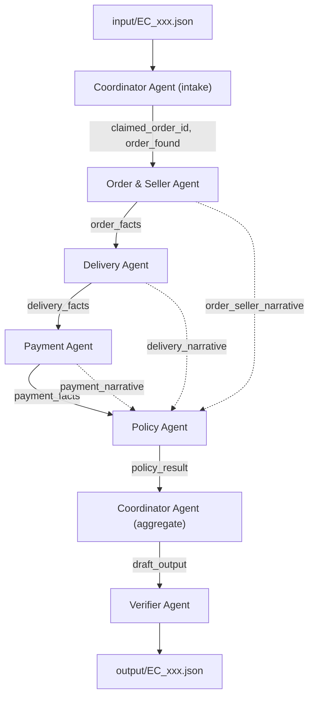

# Kiến trúc Multi-Agent — EC Dispute Resolution

## 1. Tổng quan luồng handoff

Mỗi case chạy tuần tự qua 7 node LangGraph (`src/graph.py`):
`coordinator_intake → order_seller → delivery → payment → policy → coordinator_finalize → verifier`.

State được truyền qua một `CaseState` (TypedDict, `src/state.py`) dùng chung cho toàn bộ graph; mỗi node chỉ đọc field nó cần và ghi field mới, không có node nào ghi đè kết quả của node khác. `trace_events` dùng reducer `operator.add` để cộng dồn log của từng bước thành `trace.jsonl`.

## 2. Nguyên tắc thiết kế cốt lõi

- **Tách rời tính toán và suy luận ngôn ngữ.** Mọi con số/ID xuất hiện trong output (tiền, entity id, evidence id, root cause) được tính bằng Python thuần từ CSV (`src/facts.py`, `src/policy_rules.py`) — LLM không bao giờ được yêu cầu tự tính tiền hay tự đặt ra ID. Vai trò của LLM trong mỗi agent chỉ là đọc facts đã tính sẵn và viết 1-2 câu diễn giải bằng tiếng Việt, được lưu vào trace để thể hiện agent "hiểu" dữ liệu, nhưng không có quyền đổi kết quả.
- **Quyền truy cập dữ liệu theo domain**, ép bằng cách mỗi agent chỉ gọi hàm truy vấn cho domain của nó trong `src/data_loader.py` / `src/facts.py` (xem bảng mục 4). Ví dụ Policy Agent hoàn toàn không import `data_loader` — nó chỉ nhận `order_facts`/`delivery_facts`/`payment_facts` do 3 agent trước handoff qua state.
- **Verifier là gate cuối, không phải advisory.** Các kiểm tra giới hạn mảng, tồn tại evidence ID trong CSV, khoảng giá trị `confidence`, làm tròn tiền... đều là code Python xác định (deterministic), tự động cắt/sửa khi vi phạm; LLM chỉ thêm một câu nhận xét ngắn cho trace, không được sửa số liệu.

## 3. Vai trò từng agent

| # | Agent | File | Nhiệm vụ | Input nhận (handoff) | Output bàn giao |
|---|-------|------|----------|----------------------|------------------|
| 1 | **Coordinator (intake)** | `src/agents/coordinator.py::coordinator_intake` | Đọc case JSON, tra `claimed_order_id` xem có tồn tại trong Olist không; dùng LLM để gắn nhãn sơ bộ cảm nhận khiếu nại (chỉ để log, không dùng để quyết định) | `input_case` (raw JSON) | `order_found`, `claimed_order_id`, `customer_message`, `intake_hint` |
| 2 | **Order & Seller Agent** | `src/agents/order_seller_agent.py` | Xác định `order_status` (canceled/unavailable/...), danh sách seller, seller nào bàn giao trễ `shipping_limit_date` (so với `order_delivered_carrier_date`) | `order_found`, `claimed_order_id` | `order_facts` (status, seller_ids, late_sellers, item_ids...) |
| 3 | **Delivery Agent** | `src/agents/delivery_agent.py` | So sánh `order_delivered_customer_date` với `order_estimated_delivery_date` để xác định đơn có giao trễ tới tay khách hay không | `order_found`, `claimed_order_id` | `delivery_facts` (is_late, comparable) |
| 4 | **Payment Agent** | `src/agents/payment_agent.py` | Đối soát tổng `payment_value` với tổng `price + freight_value`, đếm số dòng payment, xác định split-payment hợp lệ | `order_found`, `claimed_order_id` | `payment_facts` (item_total, freight_total, payment_total, split_valid, reconciled) |
| 5 | **Policy Agent** | `src/agents/policy_agent.py` + `src/policy_rules.py` | Áp bảng ưu tiên EC_POLICY_V1 (6 nhánh) lên 3 bộ facts để chọn `primary_issue`, `root_cause_code`, `responsible_parties`, refund, action | `order_facts`, `delivery_facts`, `payment_facts` | `policy_result` (toàn bộ quyết định + evidence draft) |
| 6 | **Coordinator (aggregate)** | `coordinator.py::coordinator_finalize` | Lắp `policy_result` + `payment_facts` vào đúng schema output mục 6 README | `policy_result`, `payment_facts` | `draft_output` |
| 7 | **Verifier Agent** | `src/agents/verifier_agent.py` | Kiểm tra giới hạn mảng, tồn tại evidence ID trong CSV, khoảng `confidence`, làm tròn tiền, tính nhất quán `case_status` ↔ refund; tự sửa khi sai | `draft_output` | `final_output` → ghi `output/EC_xxx.json` |

## 4. Bảng quyền truy cập dữ liệu

| Agent | Được đọc | Không được đọc |
|-------|----------|-----------------|
| Coordinator (intake) | `olist_orders_dataset.csv` (chỉ để kiểm tra order tồn tại) | items, payments, sellers |
| Order & Seller Agent | `olist_orders_dataset.csv` (status, carrier date), `olist_order_items_dataset.csv` (seller_id, shipping_limit_date), `olist_sellers_dataset.csv` | payments |
| Delivery Agent | `olist_orders_dataset.csv` (delivered/estimated date) | items, payments, sellers |
| Payment Agent | `olist_order_payments_dataset.csv`, `olist_order_items_dataset.csv` (chỉ price/freight_value) | sellers, review |
| Policy Agent | Không đọc CSV — chỉ nhận `order_facts`/`delivery_facts`/`payment_facts` qua state | mọi CSV trực tiếp |
| Coordinator (aggregate) | Không đọc CSV — chỉ nhận `policy_result`/`payment_facts` | mọi CSV trực tiếp |
| Verifier Agent | Toàn bộ index ID hợp lệ (`valid_order_ids`, `valid_item_keys`, `valid_payment_keys`, `valid_seller_ids`) — chỉ để đối chiếu tồn tại, không dùng để tạo evidence mới | ghi output nếu chưa qua kiểm tra |

Việc giới hạn quyền truy cập được ép bằng code: mỗi agent chỉ import đúng hàm truy vấn domain của nó trong `data_loader.py`/`facts.py`; Policy Agent và Coordinator (aggregate) không import `data_loader` nên không thể tự ý lấy thêm dữ liệu ngoài những gì được handoff.

## 5. Model, framework, runtime

- **Model**: một model duy nhất cho toàn bộ 6 agent — `nvidia/nemotron-nano-9b-v2:free` (NVIDIA Nemotron Nano 9B v2, 9B tham số dense, ≤10B theo yêu cầu), gọi qua OpenRouter (OpenAI-compatible API). Model là hybrid-reasoning nên mọi prompt được gửi kèm chỉ thị `/no_think` để tắt chain-of-thought (không cần thiết cho việc tóm tắt 1 câu), giảm độ trễ từ ~14s xuống ~2s/lời gọi. Khai báo trong `src/config.py`, phản chiếu vào `logging/metadata.json`.
- **Framework orchestration**: LangGraph (`StateGraph`) — mỗi agent là một node, handoff qua `CaseState`.
- **API key**: `OPENROUTER_API_KEY` đọc từ `.env` (không commit), theo `.env.example`.

## 6. Xử lý lỗi / an toàn dữ liệu

- Nếu `claimed_order_id` không tồn tại trong `orders.csv`: pipeline không suy diễn dữ liệu giả — mọi agent trả về facts rỗng, Policy Agent xuất kết quả `no_action`, `confidence=0.05`, `evidence_ids=[]` thay vì bịa bằng chứng.
- Nếu lời gọi LLM lỗi/hết retry (`src/llm_client.py`, tối đa 4 lần, backoff luỹ thừa): agent vẫn tiếp tục với facts xác định đã tính, chỉ để trống phần diễn giải — không chặn pipeline vì các trường được chấm điểm không phụ thuộc vào việc LLM có trả lời hay không.
- Nếu một case lỗi ngoài dự kiến (exception): `main.py` bắt lỗi, ghi trace `pipeline/error`, và vẫn xuất một file `output/EC_xxx.json` fallback an toàn (`no_action`, `confidence=0.0`) để không thiếu file khi nộp bài.
