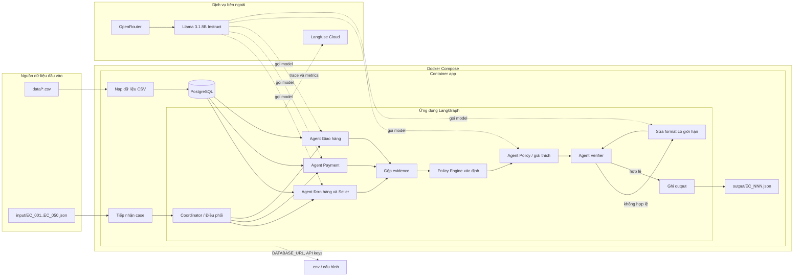
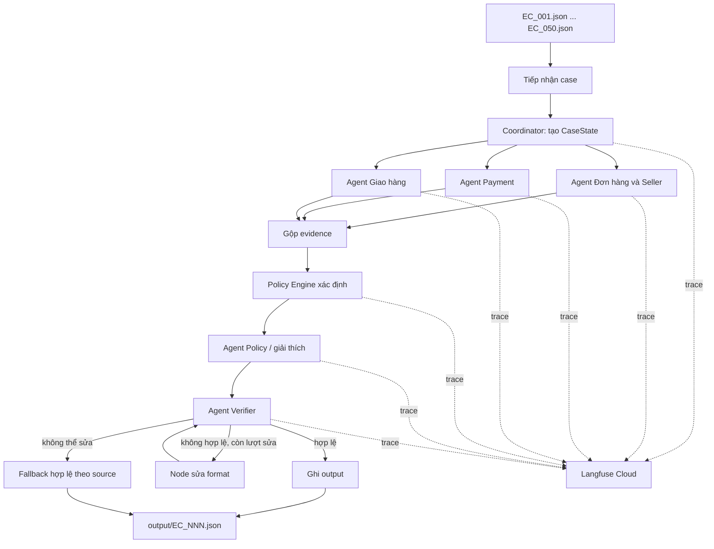

# Kiến trúc hệ thống giải quyết khiếu nại thương mại điện tử

## 1. Mục tiêu

Hệ thống xử lý 50 case trong thư mục `input/`, điều tra order Olist tương ứng,
áp dụng `EC_POLICY_V1` và ghi một kết quả JSON đã được kiểm tra cho mỗi case vào
thư mục `output/`.

Kiến trúc sử dụng LangGraph để điều phối, PostgreSQL để lưu dữ liệu vận hành và
trạng thái chạy, Langfuse Cloud để quan sát/ghi trace, và model Llama 3.1 8B Instruct
thông qua OpenRouter cho việc suy luận của agent và tạo phần giải thích.

Model không được phép tự tạo order event, payment, refund record, tracking
checkpoint hoặc evidence ID. Việc join dữ liệu, so sánh ngày giờ, tính tiền, áp
dụng policy và kiểm tra evidence phải được thực hiện bằng logic xác định trong
code để có thể kiểm chứng.

Không sử dụng embedding model trong luồng xử lý chính. Dataset có khóa quan hệ
và policy rõ ràng nên truy vấn chính xác bằng PostgreSQL phù hợp hơn semantic
search; embedding chỉ có thể được bổ sung cho một tính năng tìm kiếm tài liệu
không ảnh hưởng đến quyết định refund.

## 2. Công nghệ và triển khai

| Thành phần | Trách nhiệm |
| --- | --- |
| Python application | Đọc case, chạy LangGraph, kiểm tra kết quả và ghi file output |
| LangGraph | Điều phối coordinator, các nhánh điều tra song song, policy engine, verification và vòng sửa format |
| OpenRouter | Cổng gọi model `meta-llama/llama-3.1-8b-instruct` (Llama 3.1 8B Instruct) |
| PostgreSQL | Lưu dữ liệu Olist đã chuẩn hóa, case, handoff giữa agent, trạng thái chạy và kết quả đã kiểm tra |
| Langfuse Cloud | Ghi một trace cho mỗi case và observation cho từng graph node/agent |
| Docker Compose | Chạy application và PostgreSQL cùng nhau; gửi trace đến Langfuse Cloud qua biến môi trường |
| `logging/` | Lưu metadata và trace của lần chạy mới nhất |

Tất cả agent sử dụng model có tối đa 10B parameters. Tên model phải được khai
báo trong source code và `metadata.json`; secret chỉ được truyền qua `.env` và
không được commit.

PostgreSQL là database server, không phải file đơn giống SQLite như
`postgres.db`. Vì vậy Docker sẽ lưu dữ liệu PostgreSQL trong named volume và
application kết nối qua `DATABASE_URL`. Tên database logic có thể là
`olist_disputes`.

### Sơ đồ kiến trúc hệ thống



Ba agent domain đọc dữ liệu từ PostgreSQL theo các nhánh song song. Các handoff
được gộp tại node `Evidence Join`, sau đó `Policy Engine` áp dụng rule bằng code.
`Policy Agent` chỉ tạo explanation và candidate output có cấu trúc dựa trên quyết
định đã được kiểm chứng. Model không tự quyết định refund, root cause hoặc evidence.

## 3. Luồng xử lý tổng quát



Mỗi case có một lần chạy LangGraph và một trace Langfuse Cloud riêng. Ba agent domain
là các nhánh độc lập, chỉ đọc dữ liệu và có thể chạy song song. Coordinator gộp
các report có cấu trúc trước khi chuyển sang bước áp dụng policy.

## 4. State và hợp đồng handoff của LangGraph

Graph sử dụng một `CaseState` có kiểu rõ ràng. Tối thiểu state gồm:

```text
case_id
opened_at
customer_request
policy_version
order_id
order_report
payment_report
delivery_report
policy_decision
verification_report
repair_attempt
trace_id
errors
```

Mỗi agent trả về một report có cấu trúc thay vì đoạn hội thoại tự do. Report phải
cho biết các source row đã dùng, phép tính đã thực hiện, kết luận và dữ liệu bị
thiếu nếu có. Node tiếp theo nhận report thông qua graph state, không cần tự diễn
giải lại một đoạn chat không có cấu trúc.

### Trình tự handoff

1. **Case Intake → Coordinator**: kiểm tra format input và lấy `order_id` từ
   `customer_request.claimed_order_id`.
2. **Coordinator → các agent domain**: gửi cùng case identity và order ID bất
   biến cho các nhánh Order/Seller, Payment và Delivery.
3. **Các agent domain → Evidence Join**: trả về fact, source key, tổng tiền đã
   tính và kết luận của domain.
4. **Evidence Join → Policy Engine**: cung cấp fact đã gộp và các reference đã
   kiểm tra để áp dụng `EC_POLICY_V1` bằng code xác định.
5. **Policy Engine → Policy Agent**: cung cấp quyết định policy, số tiền và
   evidence đã được kiểm chứng để agent tạo explanation và candidate output.
6. **Policy Agent → Verifier**: cung cấp candidate output đầy đủ, gồm issue,
   responsible parties, evidence IDs, các giá trị tiền, confidence và actions.
7. **Verifier → Output Writer**: chỉ cho phép ghi file sau khi schema, evidence,
   policy, giới hạn và phép tính tài chính đều hợp lệ.
8. **Verifier → Repair Node**: trả về lỗi validation cụ thể cho một lần sửa có
   giới hạn. Repair node chỉ được sửa JSON/schema/format dựa trên fact có sẵn,
   không được thay đổi policy decision hoặc tạo evidence mới.

## 5. Trách nhiệm và quyền truy cập của từng agent

| Agent/node | Được đọc | Tạo ra | Được ghi |
| --- | --- | --- | --- |
| Case Intake | Input JSON | Metadata của case đã kiểm tra và order ID | Run record |
| Coordinator | Case metadata, policy version | LangGraph state và việc phân nhánh | Run status/handoff metadata |
| Order & Seller Agent | `orders`, `order_items`, `sellers`, `products` | Order status, item, seller, price, freight và fact về thời điểm seller bàn giao | Không ghi vào source data |
| Payment Agent | `order_payments`, `order_items` | Các payment row, tổng payment, đối soát item + freight và fact về split payment | Không ghi vào source data |
| Delivery Agent | `orders`, `order_items` | Ngày giao, ngày dự kiến, shipping limit và fact phân loại giao trễ | Không ghi vào source data |
| Evidence Join | Report của các domain agent | Fact bundle thống nhất và evidence candidate đã loại trùng | Không ghi vào source data |
| Policy Engine | Fact bundle và `EC_POLICY_V1` | Policy decision, root cause, responsible party, refund, action và evidence dựa trên code | Chỉ ghi decision vào run state |
| Policy Agent | Fact bundle và policy decision đã kiểm chứng | Explanation và candidate output có cấu trúc | Chỉ ghi candidate vào run state |
| Verifier Agent | Candidate output, domain report, source row trong PostgreSQL | Report pass/fail và hướng dẫn sửa cụ thể | Validation status |
| Repair Node | Candidate output và lỗi của Verifier | Candidate đã sửa schema/format dựa trên fact có sẵn | Chưa ghi kết quả cuối |
| Output Writer | Candidate đã hợp lệ | JSON cuối cùng | `output/EC_NNN.json` và result record |

Các agent chỉ có quyền đọc các bảng source Olist. Application chỉ được ghi vào
run/result layer; riêng Output Writer mới được publish kết quả cuối sau khi
Verifier thông qua.

## 6. Mô hình dữ liệu PostgreSQL

Bước ingestion nạp các file CSV vào các bảng đã chuẩn hóa, giữ nguyên source ID
và giá trị số:

```text
customers
orders
order_items
order_payments
order_reviews
products
sellers
geolocation
```

Các bảng vận hành dùng để audit handoff và tái lập kết quả:

```text
cases              -- input case JSON và policy version
runs               -- một lần chạy cho mỗi case
agent_handoffs     -- input/output có cấu trúc giữa các graph node
case_results       -- candidate đã kiểm tra và JSON cuối cùng
trace_references   -- Langfuse trace ID và run metadata
```

Quy tắc truy vấn quan trọng:

- Join `orders.order_id` với các row item và payment bằng `order_id`.
- Chỉ dùng `customer_unique_id` khi cần nhận diện cùng một khách hàng qua nhiều
  order; trong dataset này mỗi `customer_id` đại diện cho một order.
- Cộng tất cả row `payment_value`. Đây không phải là số tiền của từng installment.
- Tính `item_total_brl` bằng tổng `price` của item và
  `freight_total_brl` bằng tổng `freight_value` của item.
- So sánh timestamp đúng theo giá trị trong CSV; không chuyển đổi timezone.
- Nếu order không có item row, để rỗng các ID item/seller và đặt item total,
  freight total bằng `0.0`.

## 7. Logic quyết định policy

`Policy Engine` áp dụng các rule bằng code theo thứ tự dưới đây. `Policy Agent`
chỉ tạo explanation và candidate output dựa trên quyết định đã được kiểm chứng.
Tất cả khoản tiền được làm tròn 2 chữ số thập phân; sai số cho đối soát payment
là `0.10 BRL`.

| Ưu tiên | Điều kiện | Bên chịu trách nhiệm | Refund | Action | Root cause |
| ---: | --- | --- | ---: | --- | --- |
| 1 | `order_status = canceled` và tổng payment > 0 | `OLIST_PLATFORM` | Tổng payment | `issue_full_refund` | `ORDER_CANCELED_AFTER_PAYMENT` |
| 2 | `order_status = unavailable` và tổng payment > 0 | `OLIST_PLATFORM` | Tổng payment | `issue_full_refund` | `ORDER_UNAVAILABLE_AFTER_PAYMENT` |
| 3 | Giao sau estimated date và carrier nhận hàng sau shipping limit của seller | Seller vi phạm | Tổng freight | `refund_freight` | `SELLER_HANDOFF_AFTER_LIMIT` |
| 4 | Giao sau estimated date và carrier nhận hàng không muộn hơn shipping limit | `LOGISTICS_PROVIDER` | Tổng freight | `refund_freight` | `CARRIER_DELIVERED_AFTER_ESTIMATE` |
| 5 | Có ít nhất 2 payment row và tổng payment khớp item + freight trong sai số 0.10 BRL | Không có | 0 | `explain_valid_split_payment` | `MULTIPLE_PAYMENTS_RECONCILED` |
| 6 | Giao không muộn hơn estimated date và payment được đối soát | Không có | 0 | `reject_late_refund` | `DELIVERY_WITHIN_ESTIMATE` |

Nếu order có nhiều item, việc seller bàn giao trễ được đánh giá theo
`shipping_limit_date` của item thuộc seller đó. 50 case chính thức không có tình
huống nhiều seller bị mơ hồ.

## 8. Quy tắc verification

Trước khi ghi kết quả, Verifier kiểm tra:

- `case_id` và tên output file khớp với input case.
- `primary_issue`, `case_status`, root cause, responsible parties, refund và
  actions nhất quán với thứ tự ưu tiên của policy.
- `confidence` nằm trong `[0, 1]`.
- Mọi evidence ID đúng format cho phép và có thể dựng lại từ source row thực tế
  trong PostgreSQL hoặc từ policy code hợp lệ.
- Entity ID thuộc claimed order và các row đã join của order đó.
- `payment_total_brl` bằng tổng các payment row; item total, freight total và
  refund khớp dữ liệu nguồn và policy.
- Không vượt giới hạn: tối đa 5 ID cho mỗi entity set, 10 evidence ID, 3 root
  cause, 3 responsible party và 5 action.
- Chỉ dùng `action_required` khi có refund được đề xuất; các trường hợp còn lại
  dùng `no_action`.

Nếu verification thất bại, repair loop chỉ nhận các check bị lỗi và fact có cấu
trúc hiện có. Repair loop không được thay đổi quyết định policy. Sau số lần sửa
giới hạn, application dùng fallback xác định dựa trên source để luôn tạo một JSON
đầy đủ schema và hợp lệ; không ghi một error-only result thay cho output bắt buộc.

## 9. Ghi trace bằng Langfuse Cloud

Cấu trúc trace:

```text
Trace: một trace cho mỗi case (case_id, run_id, order_id, policy_version)
  Span: coordinator/intake
  Span: order_seller_agent
  Span: payment_agent
  Span: delivery_agent
  Span: policy_agent
  Span: verifier_agent
  Span: output_writer
```

Mỗi observation lưu node name, model name, prompt/version ID, thời gian bắt đầu
và kết thúc, trạng thái, kết quả validation và token/latency metadata nếu có.
Không đưa API key hoặc secret vào trace.

Artifact runtime được lưu trong `logging/`:

```text
logging/trace.jsonl     -- trace của 50 case trong lần chạy mới nhất
logging/metadata.json   -- model, parameter size, framework và runtime
```

Hai file trong `logging/` phải được ghi đè sau mỗi lần chạy 50 case, không append.
Để đáp ứng yêu cầu nộp bài trong README, application phải đồng bộ bản sao cuối
cùng ra root repo:

```text
trace.jsonl
metadata.json
```

Hai bản root phải giống với artifact tương ứng trong `logging/`. `metadata.json`
không được chứa API key hoặc secret.
Langfuse được dùng qua Cloud API; `LANGFUSE_HOST`, public key và secret key chỉ
được truyền qua `.env`.

## 10. Runtime Docker

`docker-compose.yml` dự kiến gồm:

```text
app       -- Python/LangGraph runner; mount data/, input/, output/ và logging/
postgres  -- PostgreSQL có persistent volume cho dữ liệu Olist và run state
Langfuse Cloud -- dịch vụ bên ngoài, không chạy trong Docker Compose
```

Application phải chờ PostgreSQL vượt qua health check trước khi ingestion hoặc xử
lý case. Database credential, OpenRouter credential và Langfuse Cloud credential
được inject qua `.env`; `.env` phải được Git ignore. Các thư mục output và logging
được mount để lưu kết quả và artifact từ máy host.

## 11. Trình tự chạy để tái lập kết quả

1. Khởi động PostgreSQL và các dependency của application bằng Docker Compose.
2. Ingest hoặc kiểm tra 9 bảng CSV Olist trong PostgreSQL.
3. Chạy LangGraph một lần cho `EC_001` đến `EC_050`.
4. Export trace mới nhất có liên kết Langfuse ra `logging/trace.jsonl` và tạo
   `logging/metadata.json`.
5. Đồng bộ hai artifact từ `logging/` ra `trace.jsonl` và `metadata.json` ở root.
6. Chạy Verifier trên toàn bộ 50 output file.
7. Kiểm tra `output/` có đúng 50 JSON file bắt buộc.
8. Commit source code và tài liệu bắt buộc ở root; khi nộp chỉ zip thư mục
   `output/`.
